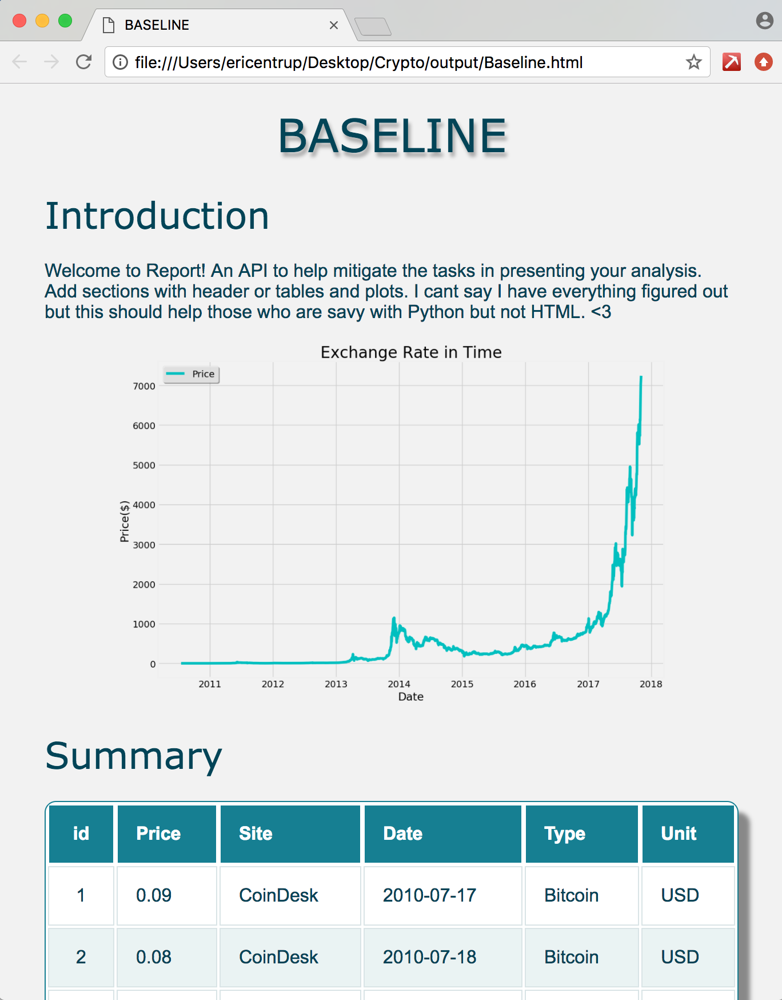

# Crypto


# Setup
- Anaconda 4.3.30
- Python 2.7
- Download all of NLTK `import nltk nltk.downlow()`
- Point shebang to your area `#!/Users/ericentrup/anaconda/bin/python2.7`
  - In `run.py`
  - In `updateDb.py`


# How to run
- To run `./run.py`
  - Optional argument: `-o /path/to/output`
  - Optional argument: `-u or --update`
- To just update database `./updateDb.py`


# Directory Structure


# Features
- Dynamically add new modules to web scrape
- Dynamically add new modules to perform analysis
- Create quick html presentations using our `Report` API
  - Using `Report`
    ``` from Utilities import Report
        
        report = Report(name = 'Something', path = '/to/output/')
        
        # Add a sections
        report.add(header = 'Introduction', text = 'Something to say')
        report.add(plot = '/path/to/image.png')
        report.add(table = pd.DataFrame())
        
        # Finally create the report
        report.create()
  '''


